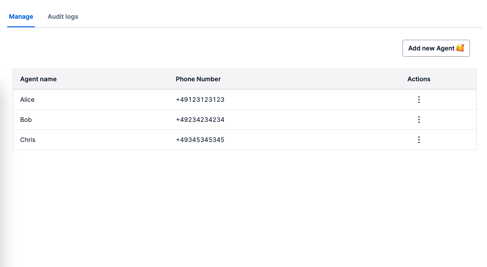
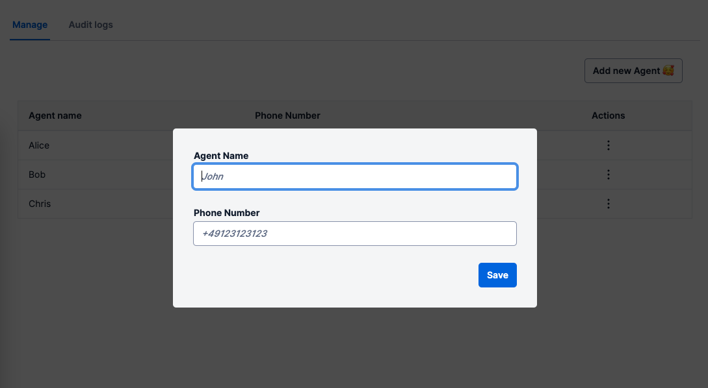
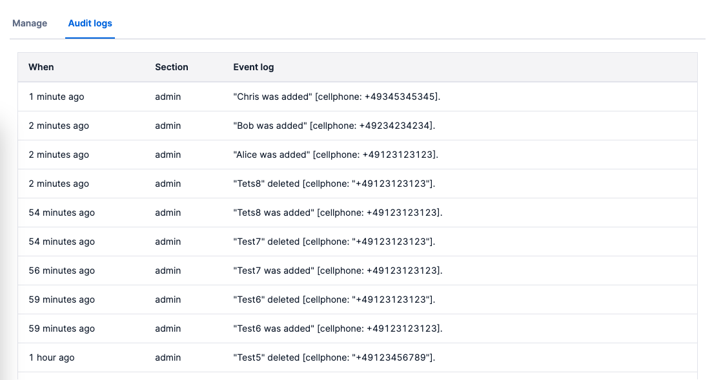
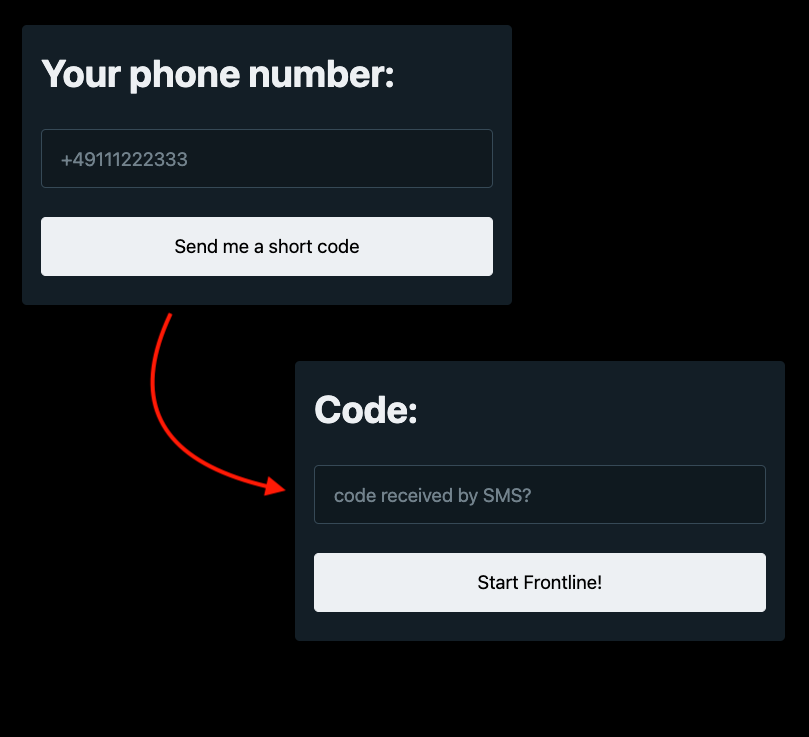

## Screenshots

Supervisor listing all the Agents:



Supervisor adding a new Agent:



Supervisor viewing the Audit Events



Agent logging in:

<p align="center" width="100%">
    
</p>

## What

This is an Identity Provider (IdP) implementation that can be hosted on Twilio Functions.
It allows the Supervisors of your Frontline to add/remove Agents by their own without the need of having a SaaS Identity Provider (IdP) of the market to manage your Agents.

Of course, if you already have an IdP - especially the ones we support on our [SSO configuration Page](https://www.twilio.com/docs/frontline/sso) - it makes no sense to use this IdP.

This project is meant for those companies who do not have an IdP and want to have Flex running as soon as possible!

**Disclaimer**: Ask your Developers to validate this project, this is not production-ready code!

## How it works

This project uses 100% of the Twilio Products and, therefore, makes it easy to have it running quickly!

- It uses [Twilio Functions](https://www.twilio.com/docs/runtime/functions) to orchestrate the SSO validation;
- It uses [Twilio Sync](https://www.twilio.com/sync) for storing the Agents;
- It uses [Twilio Verify](https://www.twilio.com/verify) to validate the authenticity of the Agents logging into Flex;
- It uses the new [Twilio Paste](https://paste.twilio.design) - which is the base for all future Flex Plugins;

## How to install

The project consist of two components:

- The Twilio Functions (back-end)
- The React Application (front-end)

Both hosted on Twilio Serverless Functions

#### To install the Twilio Functions:

1. clone this repo;
2. execute `cd ./serverless-sso` to go to the Twilio Functions folder.
3. `npm install` to install the packages into your computer.
4. rename `.env-example` from this folder to `.env` and follow the instructions in the `.env` file.
5. you have to generate the public/private pair keys for the SSO. Go to `./serverless-sso/src/assets` folder and execute the two commands below:

   ```
   openssl genrsa -out privatekey.private.cer 1024

   openssl req -new -x509 -key privatekey.private.cer -out publickey.private.cer -days 365
   ```

6. You should now have two new files in the `assets` folder: `privatekey.private.cer` and `publickey.private.cer`. You know the rules, don't send this private key to anyone.

7. `npm run deploy` to deploy the functions to your Twilio environment.

8. Quick test to see if you have done it correctly until here. Open Chrome and check if you can visit your `https://xxxxxx.twil.io/sso/saml` - Change the `xxxxxx` to your environment that was displayed in your Terminal from **step 7** above. You should see an error `ERR_REDIRECT_FLOW_BAD_ARGS`. For now, this means: **Success until here!**

9. Now go to [Frontline SSO configuration](https://console.twilio.com/us1/develop/frontline/manage/single-sign-on?frameUrl=%2Fconsole%2Ffrontline%2Fsso%3Fx-target-region%3Dus1) to configure the SSO you just deployed with Frontline. Configure with the values below:
   - `Workspace ID`: Be creative and come up with something :)
   - `IDENTITY PROVIDER ISSUER`: `https://xxxxxx.twil.io/sso/saml`
   - `SSO URL`: `https://xxxxxx.twil.io/sso/saml`
   - `X.509 CERTIFICATE`: Put the content of `./src/assets/publickey.private.cer` there.

   - Hit `Save` button

10. Final test: Go to [Frontline App](https://frontline.twilio.com/login) page, enter your Workspace ID (Can be found on the Frontline SSO Configuration page above) and hit Enter. - You can even try to log in, you should receive an error saying "Agent not found" - This is fine for now.

#### To install the Front-end:

1. execute `cd ./frontend-sso` to go to the Plugin folder.
2. `npm install` to install the packages into your computer.
3. rename `.env-example` from this folder to `.env` and follow the instructions in the `.env` file.
4. You need to have the [Twilio CLI](https://www.twilio.com/docs/twilio-cli/quickstart). Type `twilio` in your terminal to see if you have it, if not, install it now.
5. You need the [Twilio Serverless Toolkit](https://www.twilio.com/docs/labs/serverless-toolkit/getting-started#install-the-twilio-serverless-toolkit) . Type `twilio plugins` to make sure you have it, if not, install it.
6. You need to create a new profile for your Twilio CLI, type `twilio profiles:list` to check if you are using it correctly. If not, add a new profile with the cmd `twilio profiles:add`.
7. `npm run deploy` to deploy Front-end, in the output of the command you will see the URLs of the deployed assets.
8. We are done! Go to https://xxxxxx.twil.io/index.html (see step 7) - You should see a welcome page of the Admin UI. Enter the helper token that you have configured in the Funcitons .env file and create your first agent.
9. Login to Frontline using the phone number of the agent.

## Credits

This project is a Frontline adaptation of the [Flex SSO Plugin](https://github.com/bruno222/twilio-flex-plugin-sso/tree/main/serverless-sso) made by Bruno Kilian.